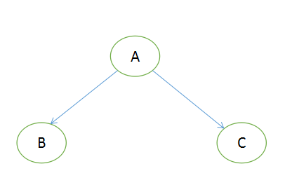
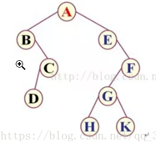
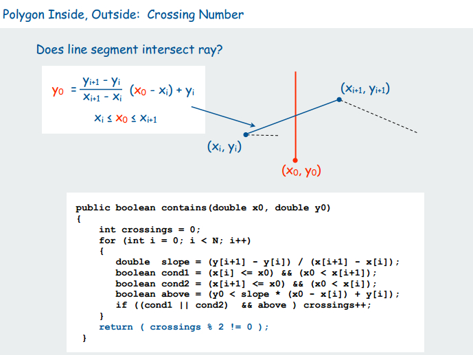

# 算法笔记

[经典总结1](https://github.com/MisterBooo/LeetCodeAnimation)

## 算法专题

### 动态规划


### 其他

## 经典问题

### 排序

- 稳定性：两个相等的数,经过排序之后,其在序列的前后位置顺序不变，则是稳定的。
  - **稳定性排序**：冒泡排序，插入排序、归并排序、基数排序
  - **不稳定排序**：选择排序、快速排序、希尔排序、堆排序
- 原地排序： 不占用额外内存资源的排序

### 分苹果问题

**一种是列出符合条件的解，可使用递归；**

**一种是让给出解的个数，用数学分析*。**

> 把M个同样的苹果放在N个同样的盘子里，允许有的盘子空着不放，问共有多少种不同的分法？M, N为自然数。说明：如有7个苹果，2个盘子，则(5, 1, 1)和(1, 5, 1)和(1, 1, 5)都是同一种分法。
>
> 输入：     第一行一个整数表示数据的组数（多组数据），对于每组数据第一行是苹果个数M (1 ≤ m ≤ 100) ，第二行是盘子个数N(1 ≤ n ≤ 100)。
> 输出：    每组数据输出一行,放苹果的方法个数。

```c
// M个苹果， N个盘子
int solution(int m,int n){   
    if(m==0||n==1)    
        return 1;     
    if(n>m)  
        return fun(m,m);  //如果前面的小于后面的，则一定会有空盘子，则等于m个苹果放入m个盘子 
    else  
        return fun(m,n-1)+fun(m-n,n);  //有空盘子的情况 +　没有空盘子的情况 
} 
```

### 斐波那契（[青蛙跳台阶](https://www.nowcoder.com/practice/8c82a5b80378478f9484d87d1c5f12a4?tpId=13&tqId=11161&rp=1&ru=/ta/coding-interviews&qru=/ta/coding-interviews/question-ranking)）

**要求计算第n项，非递归的实现**

```c
    int Fibonacci(int n) {
        if (n==0)
            return 0;
        int data[3] = {1, 0, 1};
        for(int i=0; i<n-1; i++){
            data[2] = data[1] + data[0];
            data[1] = data[0];
            data[0] = data[2];
        }
        return data[2];
    }
```

### 二叉树重建（[先序+中序](https://www.nowcoder.com/practice/8a19cbe657394eeaac2f6ea9b0f6fcf6?tpId=13&tqId=11157&tPage=1&rp=1&ru=/ta/coding-interviews&qru=/ta/coding-interviews/question-ranking)）

简单的递归实现，思路清晰，简单的思想就是通过建立子函数，每次传入子树的先序和中序序列，递归求解

```c++
TreeNode* reConstructBinaryTree(vector<int> pre, vector<int> vin) {
    TreeNode* root = reConstructBinaryTree(pre, 0, pre.size()-1, vin, 0, vin.size()-1);
    return root;
}
TreeNode* reConstructBinaryTree(vector<int> pre, int sp, int ep, vector<int> in, int si, int ei) {
    if(sp > ep||si > ei)
    	return NULL;
    TreeNode* root =new TreeNode(pre[sp]);

    for(int i=si; i<=ei; i++)
    if(in[i]==pre[sp]){
        root->left  = reConstructBinaryTree(pre, sp+1, sp+i-si, in, si, i-1);
        root->right = reConstructBinaryTree(pre, i-si+sp+1, ep, in, i+1, ei);
        break;
    }
	return root;
}
```
### 出栈顺序验证（[栈模拟](https://www.nowcoder.com/practice/d77d11405cc7470d82554cb392585106?tpId=13&tqId=11174&tPage=2&rp=2&ru=/ta/coding-interviews&qru=/ta/coding-interviews/question-ranking)）

```c++
bool IsPopOrder(vector<int> pushV,vector<int> popV) {
    if(pushV.size() == 0) return false;
    vector<int> stack; int j = 0;
    for(int i=0; i<pushV.size(); i++){
        stack.push_back(pushV[i]);
        while(j < popV.size() && stack.back() == popV[j]){
            stack.pop_back();
            j++;
        }
    }
    return stack.empty();
}
```
### 查找二叉树转双链表([链接](https://www.nowcoder.com/practice/947f6eb80d944a84850b0538bf0ec3a5?tpId=13&tqId=11179&tPage=2&rp=2&ru=/ta/coding-interviews&qru=/ta/coding-interviews/question-ranking))

```c++
    TreeNode* pre      = NULL;
    TreeNode* lastLeft = NULL;
    TreeNode* Convert(TreeNode* pRootOfTree)
    {
        if(pRootOfTree==NULL) return NULL;
        Convert(pRootOfTree->left);
        pRootOfTree->left = pre;
        if(pre != NULL)
            pre->right = pRootOfTree;
        pre = pRootOfTree;
        lastLeft = lastLeft==NULL ? pRootOfTree : lastLeft;
        Convert(pRootOfTree->right);
        return lastLeft;
    }
```

### 逆序数对

```c++
/* 归并排序：
	在数组中的两个数字，如果前面一个数字大于后面的数字，则这两个数字组成一个逆序对。输入一个数组，求出这个数组中的逆序对的总数。
*/
int divide(vector<int>& nums, vector<int>& res, int head, int tail){
        if(head>=tail) return 0;
        int mid = (tail + head) / 2;
        int cnt = divide(nums, res, head, mid) + divide(nums, res, mid+1, tail);
        int i = head, j = mid+1, p = head;
        while(i<=mid && j<=tail){
            if(nums[i]<=nums[j]){
                cnt += (j - (mid+1));
                res[p++] = nums[i++];
            } else {
                res[p++] = nums[j++];
            }
        }
        for(int m=i; m<=mid; ++m){
            cnt += (j - (mid + 1));
            res[p++] = nums[m];
        }
        for(int m=j; m<=tail; ++m)
            res[p++] = nums[m];
        copy(res.begin()+head, res.begin()+tail+1, nums.begin()+head);
        return cnt;
    }
    
    int reversePairs(vector<int>& nums) {
        int n = nums.size();
        vector<int> res(n);
        return divide(nums, res,  0, n-1);
    }
```

### 字典序算法

```shell
# 346987521的下一个字典序
1，从尾部往前找第一个P(i-1) < P(i)的位置
3 4 6 <- 9 <- 8 <- 7 <- 5 <- 2 <- 1
最终找到6是第一个变小的数字，记录下6的位置i-1
2，从i位置往后找到最后一个大于6的数
3 4 6 -> 9 -> 8 -> 7 5 2 1
最终找到7的位置，记录位置为m
3，交换位置i-1和m的值
3 4 7 9 8 6 5 2 1
4，倒序i位置后的所有数据
3 4 7 1 2 5 6 8 9
则347125689为346987521的下一个排列
```

### 删除链表重复节点

```c++
// 非递归方法
class Solution {
public:
    ListNode* deleteDuplication(ListNode* pHead)
    {
        if(pHead==NULL || pHead->next==NULL) return pHead;
        ListNode *Head = new ListNode(0);
        Head->next = pHead;
        ListNode *pre = Head;
        ListNode *ens = pre->next;
        while(ens!=NULL){
            if(ens->next!=NULL && ens->val == ens->next->val){
                while(ens->next!=NULL && ens->val == ens->next->val)
                    ens = ens->next;
                pre->next = ens->next;
                ens = ens->next;
            } else {
                pre = pre->next;
                ens = ens->next;
            }
        }
        return Head->next;
    }
};

//递归方法

```

### 搜索旋转排序数组（[字节经典](https://leetcode-cn.com/problems/search-in-rotated-sorted-array/)）

题目：假设排序数组进行了循环移N位操作，试用最少的时间查找某个值是否存在

题解：修改后的二分查找算法

```c++
// 上升序列数组经过循环移位后，二分法查找某一元素是否存在
int search(vector<int>& nums, int target) {
        int head = 0, tail = nums.size() - 1;
        while(head<=tail){
            int mid = (head + tail) >> 1;
            if(target == nums[mid]) return mid;

            if(nums[head] <= nums[mid]){
                if(target >= nums[head] && target < nums[mid]){
                    tail = mid - 1;
                } else {
                    head = mid + 1;
                }
            } else {
                if(target > nums[mid] && target <= nums[tail]){
                    head = mid + 1;
                }else{
                    tail = mid - 1;
                }
            }
        }
        return -1;
    }
```

### 排序数组中查找数字 I[ @](https://leetcode-cn.com/problems/zai-pai-xu-shu-zu-zhong-cha-zhao-shu-zi-lcof/)

```c++
class Solution {
public:
    int search(vector<int>& nums, int target) {
        int i = find (nums, 0, nums.size(), target + 0.5);
        if (i < 1 || nums[i - 1] != target) return 0;
        return i - find (nums, 0, i, target - 0.5);    
    }
    
    int find (vector<int>& nums, int i, int j, double target) {
        int mid;
        while (i < j) {
            mid = i + (j - i) / 2;
            if (nums[mid] < target) i = mid + 1;
            else j = mid;
        }
        
        return i;
    }
};
```

### 扔鸡蛋问题（[经典动态规划]( https://leetcode-cn.com/problems/super-egg-drop/solution/ji-dan-diao-luo-by-leetcode-solution-2/ )）

题目：有M层楼，已知在第N层楼以上掉落鸡蛋会碎，给你K个鸡蛋，让你用最少的操作T试探出这一楼层N。

思路：逆向思维。

该问题等价于：给你T次操作和K个鸡蛋，我们保证能找到的最高的楼层N。于是，当我们扔下鸡蛋，存在两种情况：

1. 鸡蛋没碎，这样在该楼层上方存在f(T-1,K)层楼；
2. 鸡蛋碎了，这样在该楼层下方可以检测f(T-1,K-1)层楼；

其状态转移方程为：
$$
f(T,K)=1+f(T-1,K-1)+f(T-1,K)
$$
边界条件为：$T\geq1$时，$f(T,1)=T$，当$K\geq1$时， $f(1, K)=1$。

```c++
class Solution {
public:
    int superEggDrop(int K, int N) {
        if (N == 1) {
            return 1;
        }
        vector<vector<int>> f(N + 1, vector<int>(K + 1));
        for (int i = 1; i <= K; ++i) {
            f[1][i] = 1;
        }
        int ans = -1;
        for (int i = 2; i <= N; ++i) {
            for (int j = 1; j <= K; ++j) {
                f[i][j] = 1 + f[i - 1][j - 1] + f[i - 1][j];
            }
            if (f[i][K] >= N) {
                ans = i;
                break;
            }
        }
        return ans;
    }
};
```

### K个一组反转链表[@](https://leetcode-cn.com/problems/reverse-nodes-in-k-group/solution/di-gui-si-wei-ru-he-tiao-chu-xi-jie-by-labuladong/)

```c++
ListNode* reverseKGroup(ListNode* head, int k) {
    ListNode *root = new ListNode(0, head);
    ListNode *next, *prev = root, *curr = head;

    int lens = 0;
    for(lens; head!=NULL; ++lens){
        head = head->next;
    }

    for(int i=0; i<lens/k; ++i){
        for(int j=1; j<k; ++j){
            next = curr->next;
            curr->next = next->next;
            next->next = prev->next;
            prev->next = next;
        }
        prev = curr;
        curr = curr->next;
    }
    return root->next;
}
```

### 其他

##### 毒药问题

##### 卡特兰数

##### 孤岛问题

##### 子串匹配

- 最大对称子串问题

- 最大公子串问题

- 子串匹配问题

- 最大公子序列问题

- [最长无重复子串](https://leetcode-cn.com/problems/longest-substring-without-repeating-characters/solution/javati-jie-3wu-zhong-fu-zi-fu-de-zui-chang-zi-chua/)

  ```c++
  // 滑窗调整窗口的左边界和右边界，保持滑窗内不重复，同时求取最大值，思路
  int lengthOfLongestSubstring(string s) {
      vector<int> m(128, 0);
      int ans = 0;
      int i = 0;
      for (int j = 0; j < s.size(); j++) {
          i = max(i, m[s[j]]);
          m[s[j]] = j + 1;
          ans = max(ans, j - i + 1);
      }
      return ans;
  }
  ```

  

## 数据结构

### 二叉树遍历

> 二叉树的遍历方式分为3种：前序遍历（A->B->C）、中序遍历（B->A->C）、后序遍历（B->C->A）。
>
> 已知前序和中序，后序和中序遍历序列之后，可以唯一确定一棵二叉树。但是，只知道前序和后序遍历序列，是无法知道哪个结点是左子树还算右子树。
>
> 另外的遍历方式将遍历分为深度优先遍历（DFS）和广度优先遍历（BFS）。深度优先遍历和前序遍历相似，但左右节点上没有先后顺序，此时广度优先遍历则是分层遍历，是一种自上而下的遍历方式。

**DFS实现：**

数据结构：栈

父节点入栈，父节点出栈，先右子节点入栈，后左子节点入栈。递归遍历全部节点即可

**BFS实现：**

数据结构：队列

父节点入队，父节点出队列，先左子节点入队，后右子节点入队。递归遍历全部节点即可



- ##### 举例



> 前序遍历：ABCDEFGHK
>
> 中序遍历：BDCAEHGKF
>
> 后序遍历：DCBHKGFEA

###  点与多边形 

**给定坐标系内的一个多边形和一个点，怎么判断该点是否在矩形内部？** 

**思路**：通过由该点射出的射线与各边交点的奇偶性判断是否在多边形内部。

  

### 哈夫曼树（[链接](https://blog.csdn.net/qq_29519041/article/details/81428934)）

