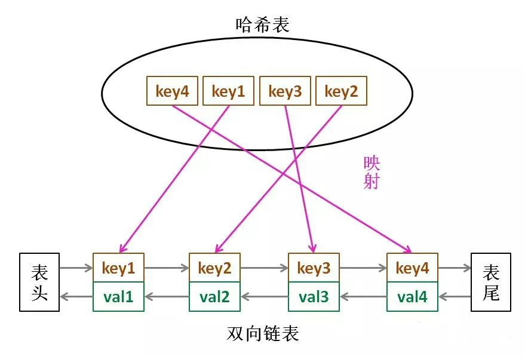

# 编程基础

## 编程常用

### 函数技巧

- ##### 输入函数

> **char *gets(char *str);** 
>
> 功能是从输入缓冲区中读取一个字符串存储到字符指针变量 str 所指向的内存空间。遇到回车后执行结束。
>
> 使用 gets() 时，系统会将最后“敲”的换行符从缓冲区中取出来，然后丢弃，所以缓冲区中不会遗留换行符。
>
> 它在执行前不会主动清除缓存空间，只是执行后才清缓存区，因此每次新接收变量前，执行getchar()。
>
> **int scanf(const char *format, ...);**
>
> 功能是从键盘输入的字符转化为“输入控制符”所规定格式的数据，然后存入以输入参数的值为地址的变量中。
>
> ```c
> // 读取含空格的字符串，遇到回车结束，并抛弃字符串中的'\n'
> scanf("%[^\n]%*c",str);
> ```
>

### 抽象容器

- #### vector

1. 构造函数
   vector():创建一个空vector
   vector(int nSize):创建一个vector,元素个数为nSize
   vector(int nSize,const t& t):创建一个vector，元素个数为nSize,且值均为t
   vector(const vector&):复制构造函数
   vector(begin,end):复制[begin,end)区间内另一个数组的元素到vector中
2. 增加函数
   void push_back(const T& x):向量尾部增加一个元素X
   iterator insert(iterator it,const T& x):向量中迭代器指向元素前增加一个元素x
   iterator insert(iterator it,int n,const T& x):向量中迭代器指向元素前增加n个相同的元素x
   iterator insert(iterator it,const_iterator first,const_iterator last):向量中迭代器指向元素前插入另一个相同类型向量的[first,last)间的数据
3. 删除函数
   iterator erase(iterator it):删除向量中迭代器指向元素
   iterator erase(iterator first,iterator last):删除向量中[first,last)中元素
   void pop_back():删除向量中最后一个元素
   void clear():清空向量中所有元素
4. 遍历函数
   reference at(int pos):返回pos位置元素的引用
   reference front():返回首元素的引用
   reference back():返回尾元素的引用
   iterator begin():返回向量头指针，指向第一个元素
   iterator end():返回向量尾指针，指向向量最后一个元素的下一个位置
   reverse_iterator rbegin():反向迭代器，指向最后一个元素
   reverse_iterator rend():反向迭代器，指向第一个元素之前的位置
5. 判断函数
   bool empty() const:判断向量是否为空，若为空，则向量中无元素
6. 大小函数
   int size() const:返回向量中元素的个数
   int capacity() const:返回当前向量所能容纳的最大元素值
   int max_size() const:返回最大可允许的vector元素数量值
7. 其他函数
   void swap(vector&):交换两个同类型向量的数据
   void assign(int n,const T& x):设置向量中第n个元素的值为x
   void assign(const_iterator first,const_iterator last):向量中[first,last)中元素设置成当前向量元素

- #### map

  - 插入元素

  ```c++
  // 定义一个map对象
  map<int, string> mapStudent;
   
  // 第一种 用insert函數插入pair
  mapStudent.insert(pair<int, string>(000, "student_zero"));
   
  // 第二种 用insert函数插入value_type数据
  mapStudent.insert(map<int, string>::value_type(001, "student_one"));
   
  // 第三种 用"array"方式插入
  mapStudent[123] = "student_first";
  mapStudent[456] = "student_second";
  ```


## 面试常问

### static标识符

一、概述
在c语言中static恰当的使用能让程序更加完美，细节上的严谨，代码会更好，也更利于程序的维护与扩展。

而static使用灵活，且又有两种完全无关的用法，所以整理总结一下。

二、static的两种用法：
1、static修饰局部变量，成为一个局部静态变量。

2、static修饰全局变量与函数，成为静态全局变量与静态函数。

三、相关涉及概念
　　可能会疑惑，修饰全局变量与修饰函数怎么会是一个用法？

　　static涉及的东西也比较多，以下有几个概念需要明白。 

 1、什么是存储类
　　简单的说也就是存储类型，c中变量是在哪里存放的？内存是怎么管理的？

　　所以内存的管理：

①栈：局部变量，函数调用传参的过程

②堆：动态存储区，需要程序员去申请释放

③数据段(data段)：显式初始化非零的全局变量(static修饰显式初始化非0的局部变量)

④bss段：显式初始化为0与未初始化的全局变量(static修饰显式初始化为0与未初始化的局部变量)

⑤text段：代码(函数)、只读数据

 

2、什么是生命周期
描述变量什么时候诞生，什么时候消亡，从诞生到消亡就是这个变量的生命周期。

①局部变量(栈)，生命周期即是进入函数，从变量创建到函数返回时变量死亡。

②全局变量(data/bss)，生命周期是程序执行到程序结束

③堆变量，生命周期是从我们malloc到free

3、什么是作用域
描述变量的作用的代码范围。c的作用域规则是代码块作用域，即是一对花括号{}。

一般的从变量定义到{}结束，即是这个变量的作用域

全局变量与数一般是文件作用域，即作用域是整个.c

4、什么是链接属性
编译器将很多源文件编译成很多.o文件后，每个.o文件里有符号、代码段、data/bss等等的分段，链接器需要通过符号将这些内存链接起来。而这些符号就是链接属性。

c中有三种链接属性：外链接、内链接、无链接属性。

外链接：外部链接，可以在整个程序(跨文件)链接。

　　　　普通的函数与全局变量。

内链接：内部连接，只能在当前.c文件进行链接。

　　　　static修饰的全局变量与函数

无链接：没有链接。

　　　   普通局部变量　

四、具体分析static的两种用法
1、static修饰局部变量(静态局部变量)与普通局部变量相比
①静态局部变量作用域与连接属性与普通局部变量一样

②存储类：静态局部变量分配在data/bss段，普通局部变量在栈上。

③生命周期：因为存储类的不同，静态局部变量的生命周期得到延长了，直到程序结束。

所以当局部静态变量离开作用域后，并没有销毁，而是仍然驻留在内存当中，只不过我们不能再对它进行访问，直到该函数再次被调用，并且值不变。

2、static修饰全局变量\函数 与 普通全局变量\普通函数相比
存储类、生命周期、作用域都一样

差别在于static修饰全局变量\函数连接属性是内连接，普通全局变量\普通函数是外链接

就是说static修饰全局变量\函数不能跨文件访问调用

五、补充：为什么需要这样？
原因是命名的冲突、一个大工程不是常常不是一个人完成的，难免会遇到全局变量、函数命名一样。为了减少这类冲突static是很有用的工具。但是很可惜并不能完全解决，所以我们应该有效的去避免减少此类情况的发生。

如果函数仅仅被同一个源文件调用时，我们就应该声明该函数为static。


### const修饰符

 C/C++ 语言中const关键字是一种修饰符，它告诉编译器，被修饰的变量具有“只读”的特点。编译时，一旦代码试图去改变修饰变量，编译器就应该给出错误提示，const对编译结果没有影响。const全局变量存储在只读数据段， const局部变量存储在栈中，代码块结束时释放。

```c++
// 指针常量
// 指针地址不能修改，不能指向其他变量
int * const pp = &num;

// 常指针， 只读指针
// 不能通过*pp指针去修改那个变量
const int * pp = &num;
```


###  野指针

1. 指针变量未初始化
2. 删除内存后没有将该指针置为NULL
3. 指针操作超越变量作用域


### sizeof用法

判断数据类型或者表达式长度的运算符，对 sizeof() 的处理都是在编译阶段进行。

- **判断变量、类或者结构体类型的大小**

用sizeof对类名操作，得到的结果是该类的对象在存储器中所占据的字节大小，由于静态成员变量不在对象中存储，因此这个结果等于各非静态数据成员（不包括成员函数）的总和加上编译器额外增加的字节。后者依赖于不同的编译器实现，C++标准对此不做任何保证。

```c
// sizof(A) = 4
class A{ int a; };

// sizof(B) = 1
class B{ char a; }; class B{};

// sizeof(C) = 8（考虑对齐）
class C{ int a; char b;};
```

#### 确定类大小的几个原则：

1. 为类的非静态成员数据的类型大小之和
2. 有编译器额外加入的成员变量的大小，用来支持语言的某些特性（如：指向虚函数的指针）
3. 为了优化存取效率，进行的边缘调整
4. 与类中的构造函数，析构函数以及其他的成员函数无关

- **判断变量或者数组的大小**

### 进程间通讯方式

1. 管道：速度慢，容量有限，只有父子进程能通讯
2. FIFO：任何进程间都能通讯，但速度慢
3. 消息队列：容量受到系统限制，且要注意第一次读的时候，要考虑上一次没有读完数据的问题
4. 信号量：不能传递复杂消息，只能用来同步
5. 共享内存区：能够很容易控制容量，速度快，但要保持同步

### 线程间通信方式

1. volatile 和 synchronized 关键字
2. 等待 / 通知机制
3. 管道输入/ 输出流
4. Thread.join() 的使用
5. ThreadLocal

### 深拷贝和浅拷贝

> 浅拷贝只复制指向某个对象的指针，而不复制对象本身，新旧对象还是共享同一块内存。
>
> 深拷贝会另外创造一个一模一样的对象，新对象跟原对象不共享内存，修改新对象不会改到原对象。
>
> 链表的复制为例

### LRU算法[@](https://www.cnblogs.com/kyoner/p/11179766.html)

LRU的全称是Least Recently Used，一种缓存淘汰常用策略。类似的还有LFU，也即按照使用频率淘汰策略。LRU认为最近使用过的数据应该是有用的，很久都没用过的数据应该是无用的，缓存满了就优先删除那些很久没有用过的数据。 

**算法描述：**

> 设计一种数据结构，首先构造函数接受一个capacity参数作为缓存的最大容量，然后实现两个API：
>
> put(key, val) 方法插入新的或更新已有键值对，如果缓存已满的话，要删除那个最久没用过的键值对以腾出位置插入。
>
>  get(key) 方法获取 key 对应的 val，如果 key 不存在则返回 -1。

**数据结构**

  

### 堆和栈区别[@](https://zhuanlan.zhihu.com/p/78478567)

一个C/C++编译程序的占用内存分为以下几个部分：

- 栈区（stack）— 由编译器自动分配释放 ，存放函数的参数值，局部变量的值等。其操作方式类似于数据结构中的栈；
- 堆区（heap） — 一般由程序员分配释放（malloc， free）， 或程序结束时可能由OS回收 ；
- 全局区（static）—，全局变量和静态变量的存储是放在一块，初始化的全局变量和静态变量在一块区域， 未初始化的全局变量和未初始化的静态变量在相邻的另一块区域，程序结束后由系统释放；
- 文字常量区 —常量字符串放在这里，程序结束后由系统释放；
- 程序代码区—存放函数体的二进制代码；

在Windows下,栈是向**低地址扩展**的数据结构，**连续**的内存区域；堆是向**高地址扩展**的数据结构，**不连续**的内存区域。

### 内存泄漏

开发人员进行程序开发的过程使用动态存储变量时，不可避免地面对内存管理的问题。程序中动态分配的存储空间，在程序执行完毕后需要进行释放。没有释放动态分配的存储空间而造成内存泄漏，是使用动态存储变量的主要问题。一般情况下，开发人员使用系统提供的内存管理基本函数，如malloc、recalloc、calloc、free等，完成动态存储变量存储空间的分配和释放。但是，当开发程序中使用动态存储变量较多和频繁使用函数调用时，就会经常发生内存管理错误，例如：

- 分配一个内存块并使用其中未经初始化的内容；
- 释放一个内存块，但继续引用其中的内容；
- 子函数中分配的内存空间在主函数出现异常中断时、或主函数对子函数返回的信息使用结束时，没有对分配的内存进行释放；

程序实现过程中分配的临时内存在程序结束时，没有释放临时内存。内存错误一般是不可再现的，开发人员不易在程序调试和测试阶段发现，即使花费了很多精力和时间，也无法彻底消除。

#### 避免方法

- **代码编写规范**

1. 始终结合使用memset和malloc分配内存，或始终使用calloc
2. 每当向指针写入值时，都要确保对可用字节数和所写入的字节数进行交叉核对
3. 在对指针赋值前，要确保没有内存位置会变为孤立的
4. 每当释放结构化的元素（而该元素又包含指向动态分配的内存位置的指针）时，都应首先遍历子内存位置并从那里开始释放，然后再遍历回父节点
5. 始终正确处理返回动态分配的内存引用的函数返回值
6. 每个malloc都要有一个对应的free
7. 确保您不是在访问空指针。

- **借助调试工具**


